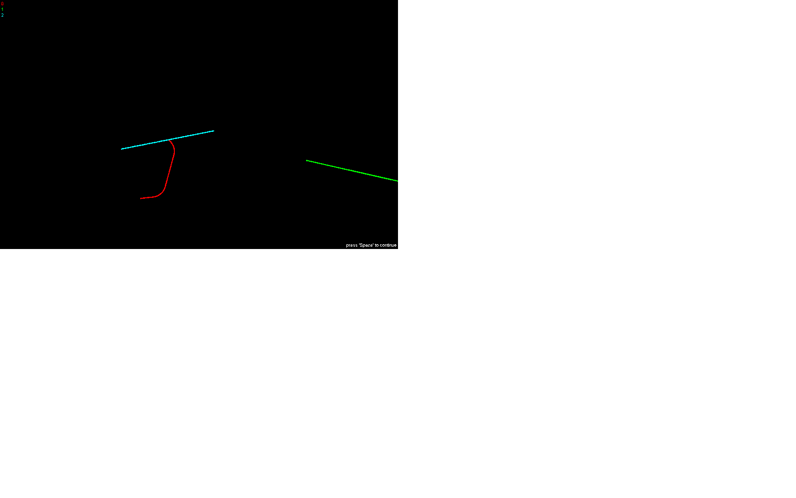

# Kurve
A simple game where the objective is to stay alive for as long as possible.

## Controls

Press *Space* to start a game after all players have joined by pressin their left key. Space continues after all players die/the game ends. Pause pauses/unpauses the game.

**Red player**: *Left Arrow* for left, *Right Arrow* for right.

**Green player**: *1* for left, *Q* for right.

**Blue player**: *Y* for left, *X* for right.

**Yellow player**: *G* for left, *H* for right.

**Magenta player**: *Left Mouse Button* for left, *Right Mouse Button* for right.

**Cyan player**: *Page Down* for left, *Page Up* for right.

## Screenshot

